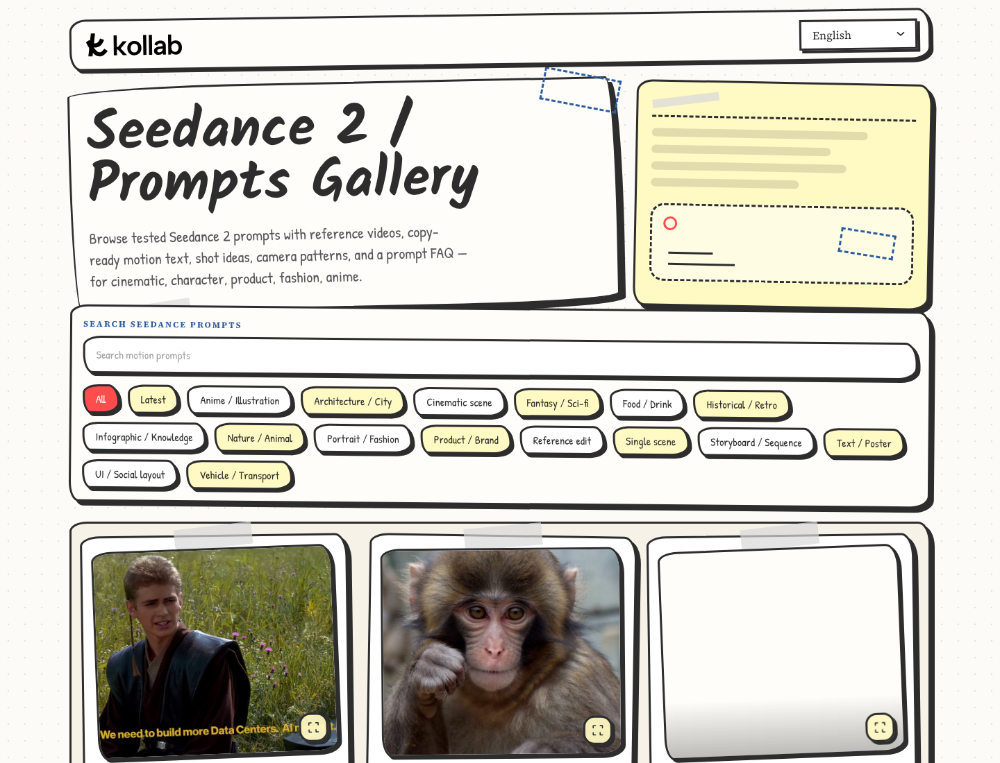

# Awesome Seedance 2 Prompts

An open-source Next.js gallery for exploring Seedance 2 video prompts, motion examples, camera-language patterns, and copy-ready prompt cards.

**Live gallery:** Explore the [Seedance 2 Prompts Gallery](https://kollab.im/seedance-2-prompts) on Kollab.

[](https://kollab.im/seedance-2-prompts)

## What Is This?

This project is the standalone source export for Kollab's Seedance 2 prompt gallery. It presents tested motion prompts with preview media, multilingual copy, search, filters, share links, and a "Try in Kollab" handoff.

It is designed for studying how strong video prompts describe time: stable subject, action beat, camera movement, pacing, transition intent, mood, and continuity. Use it as a reference for cinematic clips, anime scenes, product videos, fashion motion, social layouts, and storyboard-style workflows.

## Why Use This Gallery?

| Feature | Markdown list | This web gallery |
| --- | --- | --- |
| Motion preview | Static text | Media-first browsing |
| Search | Browser find | Full-text prompt search |
| Categories | Manual scanning | Tag filters |
| Sharing | Copy section links | Prompt-specific share URLs |
| Generation handoff | Copy and paste | "Try in Kollab" CTA |
| Mobile | Basic rendering | Responsive landing page |

## Browse By Category

- Cinematic scene
- Storyboard / Sequence
- Single scene
- Portrait / Fashion
- Product / Brand
- Anime / Illustration
- Architecture / City
- Fantasy / Sci-Fi
- Food / Drink
- Historical / Retro
- Infographic / Knowledge
- Nature / Animal
- Reference edit
- Text / Poster
- UI / Social layout
- Vehicle / Transport

## Project Structure

```text
src/app/                         Next.js App Router pages and API routes
src/components/                  Prompt gallery UI, cards, filters, lightbox, video controls
src/lib/                         Landing config, locale helpers, prompt read path
src/lib/server/landing-prompts/  Server-side read model, sync helpers, media handling
src/locales/                     Landing page copy for supported languages
public/                          Public logo and static assets
```

## Run Locally

```bash
pnpm install
cp .env.example .env.local
pnpm dev
```

The dev server defaults to port `3017`.

For a preview without local Postgres, S3, or Notion credentials, set `LANDING_PROMPTS_DEV_PROXY_URL` in `.env.local` to a host that already serves the same prompts API.

## Environment

`.env.example` contains placeholders only. The main optional integrations are:

- Notion source configuration for prompt sync.
- Postgres read-model connection for prompt browsing.
- S3/CDN media mirror settings.
- Cloudflare Stream settings for video assets.
- Public analytics tokens for browser-side analytics.

## Security Notes

This repository is intended to contain source code and placeholder configuration only. Do not commit real API keys, database passwords, internal sync tokens, private URLs, or deployment secrets.

Local secrets should stay in `.env.local`; production secrets should live in your deployment secret manager.
